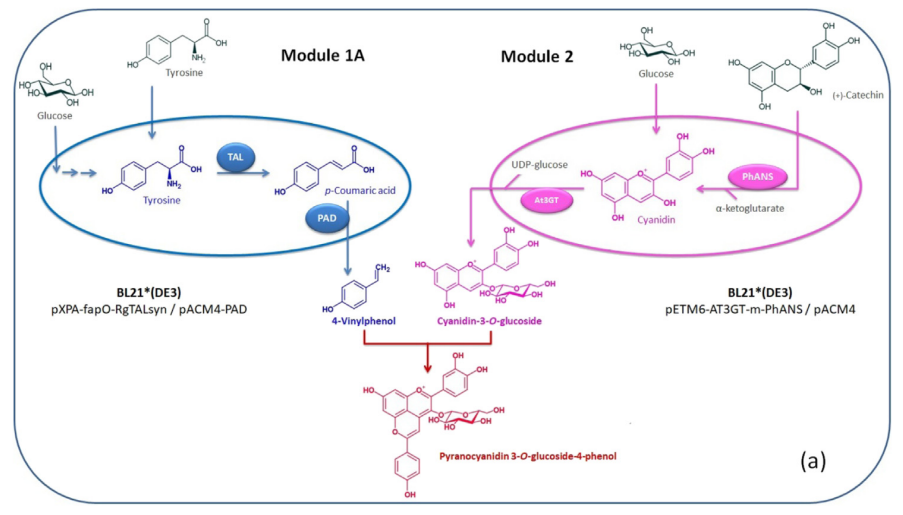
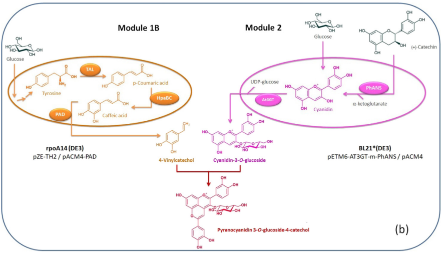
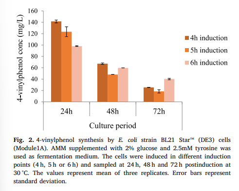
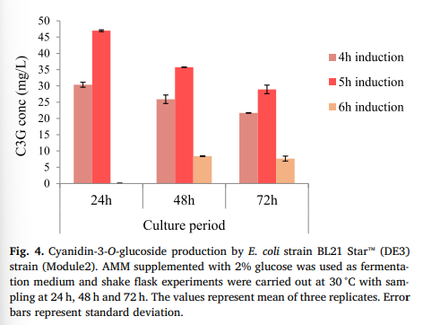

# ıntroduction

Anthocyanins also hold promise as natural colorants for food and cosmetics industries, to replace artificial and synthetic colorants that have been implicated in real or perceived medical conditions, including hyperactive behavior in children and allergy-like reactions in sensitive users.

In addition, anthocyanin usage is limited due to their color instability that is affected by various physical parameters, such as light, oxygen, and pH that can cause their interconversion between red and blue forms and lead to color loss or color changes.

While deuteration `(Chemical deuteration involves deuterating whole molecules or building blocks for the synthesis of a desired molecule by exposing them to heavy water (deuterium oxide) at high temperatures and pressures in the presence of a catalyst.)` has been shown to improve the stability of these molecules, such an approach is limited by relatively low titers of the deuterated products [@burton-freeman_chapter_2016].

Among the more than 600 anthocyanin molecules that have been identified in nature, pyranoanthocyanins are the most chemically complex. They are mostly foun in red wines and are formed during winemaking and wine maturation process by the condensation of grape anthocyanins with ceratin yeast metabolites or other compounds containing a polarizable double bond such as acetaldehyde, pyruvic acid, hydroxycinnamic acids and vinylphenols. 

Even though they exist at ppm levels in thier source, they greatly affect wine properties, such as its taste, and color. despite thier complex chemistry, their antioxidant capacity and health benefits are similar to anthocyanins found in plants showed that pyranoanthocyanins may eaisly donate an `H` to the `free radicals` and inactive them. 

Moreover, addition of `catechol` or `catechin` poriton as well as the `o-dimethoxy` motif increase thier antioxidant potential. 

`The most characteristic feature in pyranoanthocyanin structure is the formation of a fourth, pyran ring (or ring D) which provides higher color intensity and exceptional stability toward pH variations in comparison to their anthocyanin precursors.`

# Materials and Methods

## Strains and Media

*E.coli* DH5ɑ was used propagate all plasmids and LB medium (sigma) supplemented with specific antibiotics (80 μg/mL ampicillin, and 25 μg/mL chloramphenicol) depending on resistance genes used for cell growth at 37 °C. *E.coli* `BL21 Star (DE3)` and `rpoA14 (DE3)` were tested as the hosts for production of anthocyanins (C3G) and `hyrdoxylphenolic compounds (VP and VCAT),` respectively...

## Plasmid and strain constructcion

All the strains and plasmids used in this study are listed in the `Table S1`. Anthocyanin production module and phenylpropanoic acid module for *p-coumaric acid* were constructed previously in our lab. For caffeic acid production, `pZE-TH2` was used. The *`padC`* gene (phenolic acid decaroxylase, PAD) was amplified from the plasmid pJK-kanR-proJK1-PAD which was a gift feom Timothy Whitehead and was cloned into pACM4 via *`NdeI/XhoI`*. The resulting plasmid was denoted as pACM4-PAD. The primers used for PAD gene amplification were PAD_F (5ʹ-TATACATATGGGCATGGAAAACTTTAT-3ʹ) and PAD_R (5ʹ-GGTGCTCGAGTCATAAGCGACCTGCTC-3ʹ). All plasmids were transformed into host strains by the calcium chloride method and selected on LB plates with required antibiotics

To achieve the conversion of `p-coumaric acid to VP by PAD enzyme`, pACM4-PAD was co-transformed with p-coumaric acid producer plasmid (pXPA-fapO-RgTALsyn) into the two different E. coli strains. `First, tyrosine over-producer strain rpoA14 (DE3) cells were co-transformed with these two plasmids and grown in AMM medium to test VP production capacity. Secondly, BL21 Star™ (DE3) cells were co-transformed with the same plasmids and grown in AMM medium supple mented with 2.5mM tyrosine to achieve increased VP production`.

**Table 1:** Chromatographic properties of synthesized pyranoanthocyanins

|   C3G adduct    | Retention time | Molecular İon | Aglycon | Molecular formula |
| :-------------: | :------------: | :-----------: | :-----: | :---------------: |
| 4-vinylpehnol   |      17.15     |      565      |   403   |      C29H25O12    |
| 4-vinylcathecol |      15.75     |      581      |   419   |      C29H25O14    |

## PAD Activity

Briefly, total protein was extracted from mid-exponential growing *E. coli BL21 Star^tm (DE3)* cells carrying pACM4-PAD or pACM4- respectively. The decarboxylation of p-coumaric acid was conducted in 200μL of phosphate buffer (50mM, pH 7.0) containing 2.5 mM p-coumaric acid and 300μg/mL total protein at 37°C for 10 min. The reaction products were identified and quantified by HPLC. 

## Synthesis of pyranoanthocyanins and stability assay

In order to synthesize pyranoanthocyanidin-3-=-glucoside-phenol, 1 g/L of C3G was mixed with 4 g/L VP in distiled water at pH 3.2 or 30% ethaanol/water at pH 3.2 (adjusted with HCL). reaction mixture were incubated at 37 °C for 5 days and then analyzed by HPLC and LC-MS. In case of synthesis of pyranocyanidin-3-O-glucoside-catechol, 1 g/L of C3G was mixed with 5 g/L VCAT in 30% ethanol/water at pH 3.2 and incubated at  37 °C for 5 days.

`Stability of synthesized pyranoanthocyanidin-3-O-glucoside-pehnol in comparison to C3G was tested at pH 7.0, in room temperature. For this, approximately 20 mg/L of Pyranoanthocyanin or C3G were incubated at these conditions for 4 days and quantified by HPLC.`

Before conducting co-culture fermentations, production capacities of each module in mono-culture conditions were tested. 125-mL nonbaffled shake flasks containing 20 mL of medium were used for production of VP, VCAT and C3G. For this purpose , AMM medium was inoculated with 2% overnight *E. coli* cultures and cultivated at t 37 °C and 225 rpm. The cultures were induced at different time points (4 h or 5 h or 6 h) with 1mM IPTG (ısopropyl-β-d-thiogalactopyranoside) and grown at 30 °C with shaking at 225 rpm. For C3G producttion, 1g/L (+)-catechin dissolved in dimethylformamide/ethonol (8:2, v/v) was added to the medium at diferent induction points. all cultures were sampled at 24 h, 48 h, and 72 h post induction for product quantification. 

The E. coli strains used in co-culture experiments are shown in `Fig. 1`. To produce vinylphenol-pyranoanthocyanins, Module 1A [BL21 Star™ (DE3) carrying pXPA-fapO-RgTALsyn and pACM4-PAD] and Module 2 [BL21 Star™ (DE3) carrying pETM6-At3GT-m-PhANS and pACM4] were used. In this case, fermentation medium (AMM with 20 g/L glucose) was supplemented with 2.5 mM tyrosine. To produce vinylcatechol-pyranoanthocyanins, Module 1B [rpoA14 (DE3) carrying pZE-TH2 and pACM4-PAD] and Module 2 were used. The cultures were grown in AMM with 20 g/L glucose.

Co-culture studies were conducted in 20 mL of AMM medium in 125-mL nonbaffled shake flasks. The medium was inoculated with two overnight E. coli cultures at different volumetric inoculation ratios (1:1, 1:3 and 3:1) and total inocula of 0.4 mL. `The co-culture was performed at 37 °C and 225 rpm. The cultures were induced at different induction points (4 h, 5 h or 6 h) with 1 mM IPTG; 1 g/L (+)-catechin was added to the culture medium together with IPTG. After induction and substrate supplementation, co-cultures were grown at 30 °C and 225 rpm.` The quantification of pyranoanthocyanins from co-cultures was tested at 24 h, 48 h or 72 h after induction. For 5 h induced co-cultures, the concentration of produced precursors’ was calculated at 24 h after induction.

 

## Optimization of Pyranoanthocyanin production

The fermentation medium was inoculated with overnight *E. coli* strains according to the optimized inoculation ratio. The 4 h or 5 h induced co-cultures were grown for 24 h after induction and culture supernatants were harvested by centrifugation. Next, the pH of the supernatant was adjusted to 1.6 or 3.2 using 1M HCl, followed by the supplementation of different volumes of ethanol (15% or 30%, v/v). 

Subsequently, the mixture was incubated at 30 °C or 37 °C for different time periods and samples were taken periodically for HPLC analysis. To avoid evaporation, the tubes were capped tightly and sealed with parafilm. The first and last volumes of reaction medium were noted and the last calculations were made according to that. 

## Metabolite analysis

For analysis of VP and VCAT titers in monoculture, fermantation broth was mixed with an equal volume of ethanol, followed by 10-s vortexing and 10 min centrifugation at 21,000g. For C3G quantificaiton, the cell culture was mixed with acidified methanol (1%HCl, v/v) and the supernatant was used for analysis. 

Vp and VCAT (3,4- Dİhydroxy styrene) stock solutions of diffeent concentrations were prepared by dissolving in ethanol and methanol/ultrapure water (1:1, v/v), respectively. Standard stock solutions of C3G (extrasynthese) were preapared in dimethyl sulfoxide. Samples or standard solutions (10 μL) were injected for analysis on an agilent 1200 series HPLC equipped with a ZORBAX SB-C18 analytical column (150 mm x 4,6 mm, 5 μm) and a diode array detector (DAD). 

Two solvents were used as mobile phases: acetonitrile (solvent A) and water (solvent B), both containing 0,1% formic acid. A flow rate of 0.5 ml/min was used with the following gradients: 10-35% A (0-3 min), 35-70% A (3-20 min), 100% A(20-30 min) and 10% A (30-40 min). Absorbances at 260 nm (for VP and VCAT) and at 518 nm (for C3G) were monitored. The concentrations of VP, VCAT and C3G in the samples were queantified using the standards, pyranoanthocyanins concentrations were calculated using the C3G standard curve at 500 nm as desired in the literature. 

## Purification of Pyranoanthocyanins by HPLC

The reaction products (pyranoanthocyanidin-3-O-glucoside-phenol and pyranocyanidin-3-O-glucoside-catechol) were purified via HPLC with 40 μL injection volume according to the same HPLC protocol (1 mL/min flow rate used instead of 0.5 mL/min) and their structures were identified by measuring high resolution high mass accuracy mass spectra

## HPLC-MS Analysis

Chromatographic separation was performed on Agilent 1200 HPLC system (Agilent Technologies, Santa Clara, CA, USA) using Agilent ZORBAX Eclipse XDB-C18 (4.6 × 150 mm, 5μm) column, with injection volume of 5–8 μL. Water and acetonitrile each containing 0.2% formic acid were used as solvents A and B, respectively, at a flow rate of 250 μL/min, using the following gradients: 10–35% B (0−3min), 35–70% B (3−20min), 100% B (20–30 min) and 10% B (30–40min). Mass spectral analyses were performed on Thermo LTQ Orbitrap XL (Thermo, Bremen, Germany) instrument with electrospray ionization (ESI), positive-ion mode at the resolution of 30,000 and with mass accuracy better than 3 ppm in both MS and MSMS modes.

# Results
## Production of 4-vinylphenol, 4-vinylcatechol and Cyanidin-3-O- glucoside From *E. coli* Monocultures

Two different *E. coli* strains were tested to produce VP. Firstly, rpoA14 (DE3) was transformed with VP production module (pXPA-fapO-RgTAL^syn/pACM4-PAD) and grown in AMM medium containing 2% glucose for 24 h or 48 sh. The strain could produce nearly 140 and 220 mg/L *p-coumaric acid* at 24 h and 48 h respectively, while final titers of only 6.6 and 3.2 mg/L of VP were achieved, revealing very poor conversion of p-coumaric acid to VP. 

The very low conversion efficiency of p-coumaric acid to VP led us to monitor the activity of PAD enzyme in the recombinant strain. However, in vitro PAd activity showed that PAD enzyme successfully converts all *p-coumaric acid* to VP (Figure S2), indicating that low conversion rate in rpoA14 (DE3) cells was possibly due to toxic effects VP on this strain. In order to address this problem, the VP production module plasmöid was into BL21 star^tm (DE3) cells. As shownin `Figure 2`, BL21 Star^tm (DE3) cells produced more than 100 mg/L VP in 24 h under all induction conditions tested. However, VP concentration in the fermentation broth decreased after 24 h. 

High final titer of VCAT production from rpoA14 (DE3) cells (module 1B) compared with BL21 (DE3) was obtained in AMM medium supplemented with 2% glucose at 30 °C `(Figure 3)`. The induction of 6 h post-inoculation showed the highest VCAT production (~ 350 mg/L) at 48h.

 

 In glucose supplemented AMM medium, production of C^G by BL21^tm star (DE3) strain (module 2) was achieved with induction at different time points `(Figure 4)`. The highest C3G production was 45 mb/L at 24 h with production decreasing after that, a phenomenon that has been observed extensively in our previous studies and which might be due to the degredation of anthocyanins at natural pH. 

 

 